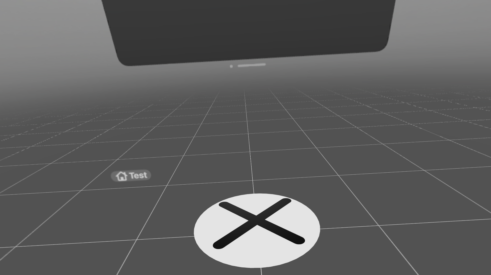

# RealityViewTapSoundBug
VisionOS Project to Demonstrate a bug of the lack of a system sound when tapping a 3D entity compared with a SwiftUI attachment

Here is a screenshot showing the immersive space and the 3D button on the floor and a SwiftUI attachment button that has the correct behavior:

